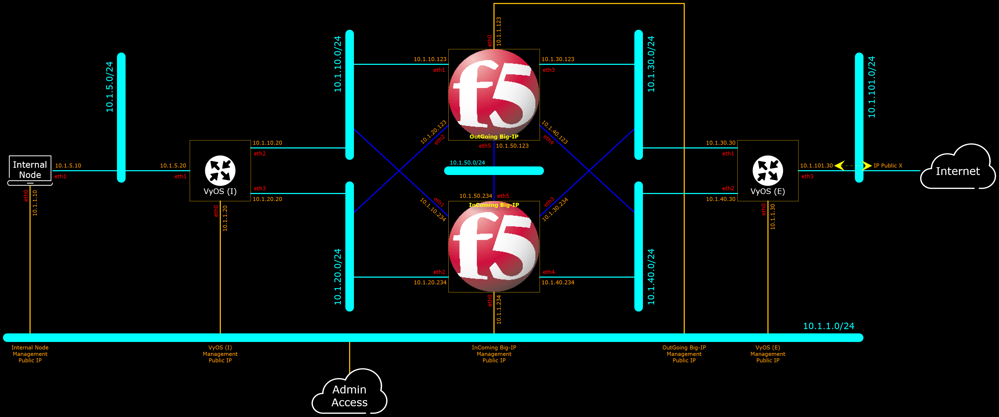
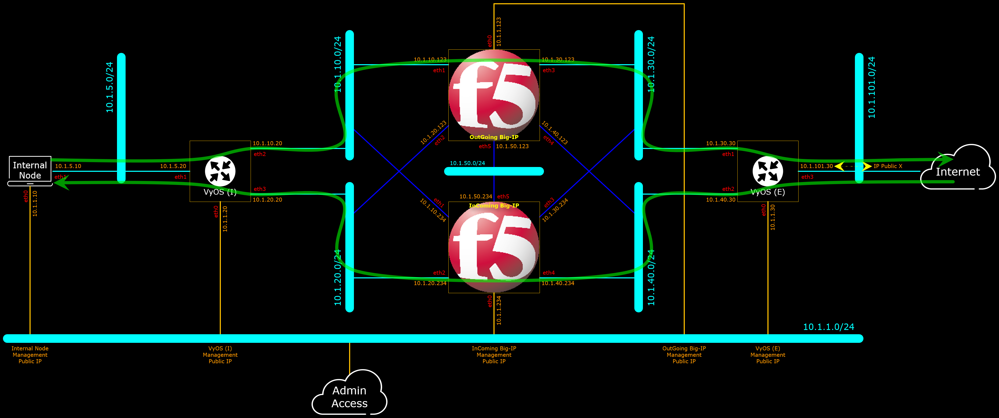
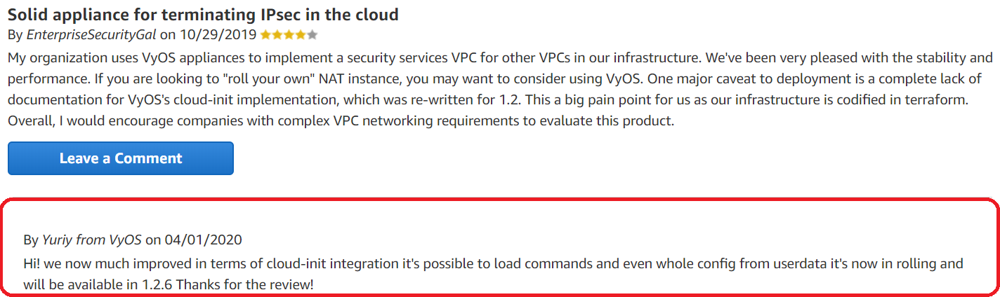
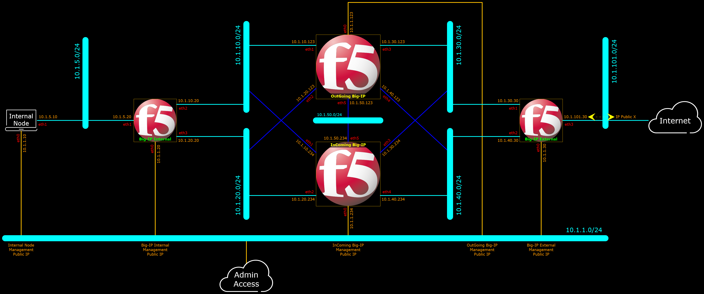
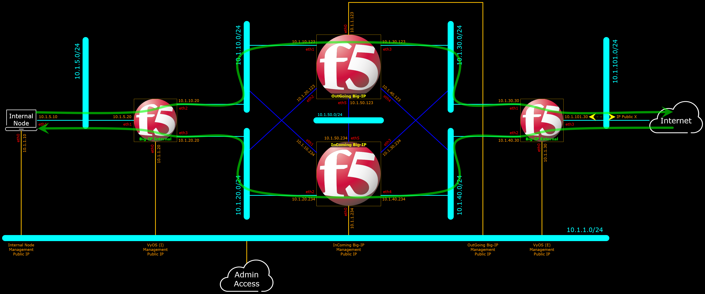
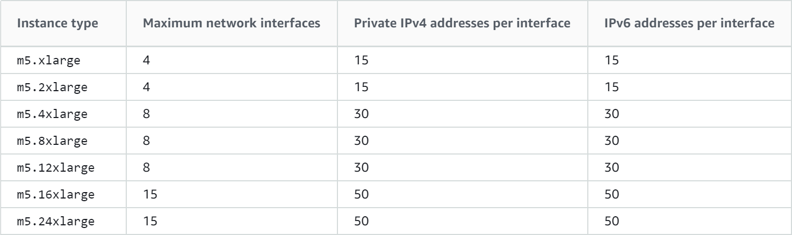

# CloudFormation Asymmetric Route

The purpose of this repository is to build Test/Demo Environment with Asymmetric Route.
Originally the Test/Demo Environment is planned to be implemented as below diagram, which describes the targeted Logical Network Diagram the CloudFormation designed to build.

Below the same diagram depicting the traffic flows through the network elements in the network.

Similar environment (but NOT exactly the same) has been successfully built on VMware Workstation with the help of VyOS to create the asymmetricity of the traffic.
However since VMware Workstation portability is not flexible enough (to transfer the image-files, one will need to upload/download tens of GigaBytes of image-files), and to run the VMware images one will require top of the class Laptop/Desktop with a lot CPU and Memory resources;
therefore building the environment on AWS where the resources are abundant and there is no need to transfer upload/download tens of GigaBytes of image-files, the AWS CloudFormation solution is viewed as a very good alternative.

However upon more research and quite some attempts to build a VyOS node with CloudFormation, it is revealed that VyOS is NOT capable to support Cloud-Init through User-Data form, as referred on the below highlighted respond to a customer feedback/review on VyOS product page on AWS.

Therefore the Test/Demo Environment plan is changed to use yet another two Big-IP instead of VyOS, as described on the below diagram:

With the traffic flow similar as before, depicted in the below diagram:

Images provided are high resolution images, click on the images to get better/readable resolution, or go to [Figures](Figures/) folder.

The latter configuration where the asymmetricity is provided by Big-IP, is a much better configuration for a couple of reasons :

* As per designed, the number of interfaces per node are fixed. The positions for Big-IP require 4 or 6 interfaces. The Internal Node requires only 2 interfaces.
  So it does not matter which platform implemented at the position (VyOS-I/VyOS-E or Big-IP Internal/Big-IP External), the Instance Type are fixed as per excerpt reference table above.
  So using VyOS does NOT reduce the Instance Type cost.
  On contrary, VyOS incurs more cost, because the Big-IP implemented are BYOL (Bring Your Own License), while VyOS only provides the paid version.
  The VyOS community version does not guarantee that the images are safe to use and do not contain any malware.
* With Big-IP replacing VyOS, makes it possible to do Test/Demo of asymmetricity at the corresponding position for Big-IP.
  While if VyOS is used, the chance to do test and demo Big-IP capabilities in those positions are eliminated.

Going on forward, VyOS will no longer be considered to be used in this Repository, and possibly also other Repositories with similar needs for VyOS.

***

 

The [CF/CF_Asymmetric_Route_Empty.json](CF/CF_Asymmetric_Route_Empty.json) template creates the building blocks only as per depicted on the diagram above :
1. Four Big-IP instances and one Ubuntu Server 16.04 in a new VPC built as per diagram above.
2. The Big-IP instances are licensed with the provided Registration Key Licenses.
3. No traffic related configuration on Big-IP, so traffic will not be forwarded anywhere.

***

To Do:

- [ ] AS3 for All Big-IP(s) to just flow the traffic asymmetrically.

***

