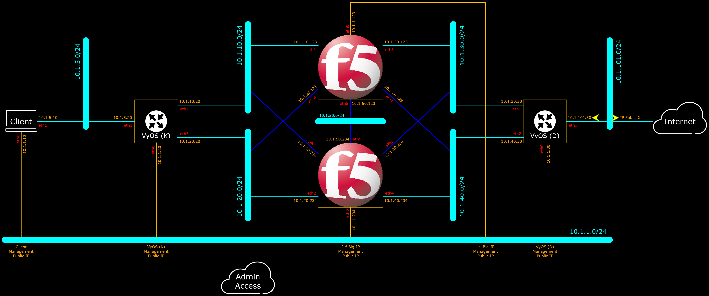
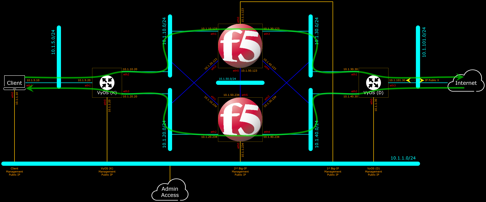

# CloudFormation Asymmetric Route

The purpose of this repository is to build Test/Demo Environment with Asymmetric Route. Diagram below describe the targeted Logical Network Diagram which the CloudFormation designed to build.

Below the same diagram depicting the traffic flows through the network elements in the network.

***

VyOS Update :

VyOS is NOT capable to support Cloud-Init through User-Data form, as referred on the below highlighted respond to a customer feedback/review on VyOS product page on AWS.

To Do:

- [ ] Post the current CF which Implements the Environment (only minus the 2 VyOS and Internal Node only)
- [ ] May Implement VyOS Part with yet another 2 Big-IPs

***

